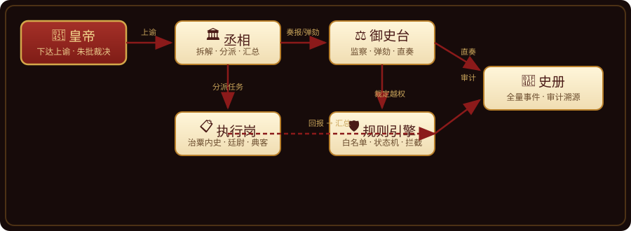

<p align="center">
  
</p>

<p align="center">
  <b>制度为一等公民的多智能体编排系统</b><br>
  古代政治制度作为<b>可换装的编排层</b>，严格约束每个 agent 的岗位职责、职权边界、通信协议与汇报链路
</p>

<p align="center">
  <a href="#核心特性"></a>
  <a href="#快速开始"></a>
  <a href="#快速开始"></a>
  <a href="#测试"></a>
  <a href="#真实运行效果"></a>
  <a href="LICENSE"></a>
</p>

---

## ✨ 核心特性

| | 特性 | 说明 |
|---|---|---|
| 🎭 | **制度换装** | 制度 = YAML 配置。角色体系、职权边界、通信协议、汇报链路、权力制衡全部可换——换制度 = 换文件，任务与制度解耦。内置三公九卿（8 岗位） |
| 🛡 | **严禁越权** | 工具白名单 + 消息路由拦截双重硬约束。确定性判定由规则引擎执行，**绝不交给 LLM 自觉** |
| ⚖️ | **权力制衡** | 御史台监察弹劾（特权直奏）、皇帝朱批裁决、革职/留任警告职位变动 |
| 🧠 | **真实 agent 网络** | 消息总线驱动各岗位 agent（LLM）自主工作——皇帝下旨后，丞相拆解分派、执行岗干活回报、御史台监察，全自动流转 |
| 👑 | **沉浸式皇帝体验** | 金銮殿场景、奏折递交动画、朱批、拟旨、官职墙、御史台案卷，SSE 实时推送 |
| 📊 | **政事进度** | 任务进度百分比实时展示——下旨后看朝堂如何一步步办结 |
| 🎭 | **人格画像** | 百官皆有姓名/字/性情/施政风格（LLM 生成），革职任命自动换人 |
| 📜 | **史册审计** | 全量事件流 = 史册 = 御史台数据源，任何行为可溯源 |
| 🏗 | **深模块设计** | 7 层分层，每层一个深模块（小接口、重行为），测试覆盖协议层/行为层/API/调度器 |

---

## 🏛 真实运行效果（DeepSeek flash 实测）

<p align="center">
  
</p>

```
👑 皇帝下旨「整理第三季度业绩报告」
→ 🏛 丞相 agent：拆解上谕为 2 个子任务，分派治粟内史
→ 📋 治粟内史 agent：run_task 执行 → report_result 回报丞相
→ 🏛 丞相 agent：汇总复核，呈报奏折
   「一、总体情况… 二、增长部门：典客对外交流环比增长约12%…」
✍️ 皇帝批红：approved
```

> 🎬 **名场面**：演示中丞相 agent 试图越权调用执行工具，被规则引擎当场拦截，agent 主动承认 *"不在丞相职权范围内，符合铁律"* ——制度硬约束真实生效，不是摆设。

**朝堂众生相**（人格画像，LLM 生成，姓氏去重）：

```
👑 丞相    谢衡    字持中  — 沉稳果决，善谋善断
🏛 太尉    苏晏清  字子佩  — 温润机敏，谈笑间定乾坤
⚖️ 御史大夫 魏玄度  字伯昭  — 刚直不阿，明察秋毫
📋 治粟内史 杜衡    字子衡  — 沉毅缜密，不务虚名
⚖️ 廷尉    韩敬之  字慎言  — 沉毅果决，不徇私情
```

---

## 🗺 架构分层

```
┌─────────────────────────────────────────────────────┐
│  Frontend (React + Vite + TS + Tailwind)           │
│  🎨 金銮殿场景 · 奏折动画 · SSE 实时推送              │
└──────────────────────┬──────────────────────────────┘
                       ↓ HTTP + SSE
┌──────────────────────▼──────────────────────────────┐
│  API Layer (FastAPI)                                │
│  📡 路由 · 契约校验 · 事件广播 · 进度查询             │
└──────────────────────┬──────────────────────────────┘
                       ↓
┌──────────────────────▼──────────────────────────────┐
│  Court Domain (领域服务)                             │
│  📜 上谕 / 奏折 / 弹劾 / 任命 / 人格画像              │
└──────────────────────┬──────────────────────────────┘
                       ↓
┌──────────────────────▼──────────────────────────────┐
│  Message Bus (asyncio)                              │
│  🔀 路由校验(白名单) + 审计 + 多任务聚合              │
└──────────────────────┬──────────────────────────────┘
                       ↓
┌──────────────────────▼──────────────────────────────┐
│  Agent Layer (薄循环)                               │
│  🧠 AgentLoop / LLMClient / 工具 / 调度器 / Persona  │
└──────────────────────┬──────────────────────────────┘
                       ↓ 每个工具调用都过这道关
┌──────────────────────▼──────────────────────────────┐
│  Rule Engine (规则引擎)                             │
│  🛡 静态查表 + 动态策略 · judge() 统一入口            │
└──────────────────────┬──────────────────────────────┘
                       ↓
┌──────────────────────▼──────────────────────────────┐
│  Storage (SQLite)                                  │
│  💾 事件表 = 史册 = 御史台数据源                     │
└─────────────────────────────────────────────────────┘
```

---

## 🎮 场景预览

| 金銮殿（主场景） | 御史台（移驾） |
|---|---|
| 👑 皇帝御座视角 · 丞相进殿呈奏 · 御案奏匣 · 政事进度 | ⚖️ 案卷库 · 弹劾卷宗 · 朱批准奏/驳回 |

| 百官名册（翻阅） | 拟旨下谕（御笔） |
|---|---|
| 📜 典籍册页 · 人格画像 · 革职空缺 · 盖印任命 | ✍️ 圣旨卷轴 · 表单拟旨 · 玉玺落下 |

---

## 📚 文档

| 文档 | 说明 |
|---|---|
| [需求基线](docs/requirements.md) | grill-me 确认的全部决策（23 项） |
| [架构总览](docs/architecture.md) | 分层、深模块、表结构、流程 |
| [API 契约](docs/api-contract.md) | 前端开发契约（7 组端点 + SSE） |
| [前端设计指令](docs/frontend-design-brief.md) | 沉浸式 UI 设计规范 |
| [金銮殿 Spec](docs/frontend-throne-spec.md) | 场景化交互设计（v2） |

**分模块架构文档**（docs/arch/）：

| 文档 | 覆盖 |
|---|---|
| [Agent 架构](docs/arch/agent-architecture.md) | 薄循环 / LLMClient / 工具注册表 / 审计 |
| [组织架构](docs/arch/organization-architecture.md) | 制度-as-数据 / 岗位体系 / 权力制衡 / 人格画像 |
| [调度架构](docs/arch/scheduler-architecture.md) | 消息驱动网络 / single-flight / 多任务聚合 |
| [规则引擎架构](docs/arch/rule-engine-architecture.md) | 静态查表 + 动态策略 / 铁律与 LLM 的边界 |
| [通信总线架构](docs/arch/bus-architecture.md) | 路由校验 / 审计 / 违制上报 |
| [前端架构](docs/arch/frontend-architecture.md) | 场景组件树 / SSE 流 / 呈奏状态机 |

---

## 📁 目录结构

```
imperial-court/
├── backend/
│   ├── institutions/          # 🎭 制度定义（YAML，一等公民）
│   │   └── sanguan-jiuqing.yaml
│   ├── imperial/              # Python 包
│   │   ├── institution/       # 制度加载与校验
│   │   ├── rule_engine/       # 🛡 规则引擎（静态+动态）
│   │   ├── bus/               # 🔀 异步消息总线
│   │   ├── agent/             # 🧠 薄循环/LLM/工具/调度器/人格
│   │   ├── court/             # 📜 领域服务（上谕/奏折/弹劾/任命）
│   │   ├── storage/           # 💾 SQLite 薄封装
│   │   └── api/               # 📡 FastAPI + SSE + bootstrap
│   ├── scripts/               # demo_court.py 真实端到端演示
│   └── tests/                 # 67 测试（协议/行为/API/调度器）
├── frontend/                  # 🎨 React + Vite + TS + Tailwind
│   └── src/
│       ├── components/        # ThroneHall · ChancellorArrival · 奏匣 · 进度
│       └── pages/             # 御史台 · 百官名册 · 拟旨
└── docs/                      # 📚 需求/架构/契约/设计指令/SVG 彩图
```

---

## 🚀 快速开始

```bash
# 1. 后端（Python ≥3.10，uv 管理）
cd backend
uv venv --python 3.12
uv pip install -e ".[dev]"
cp .env.example .env        # 填入 IMPERIAL_LLM_API_KEY
uv run uvicorn imperial.api.main:app --reload   # http://localhost:8000

# 2. 前端
cd frontend
npm install
npm run dev                 # http://localhost:5173  👑 坐镇金銮殿

# 3. 真实 agent 端到端演示（可选）
cd backend
.venv/bin/python -m scripts.demo_court
```

> 💡 **体验路径**：打开 http://localhost:5173 → 御笔拟旨下谕 → 看政事进度百分比上涨 → 丞相进殿呈奏（动画）→ 御案奏匣批红 → 移驾御史台查案 → 翻阅百官名册。

---

## ✅ 测试

```bash
cd backend
.venv/bin/python -m pytest tests/     # 102 passed + 3 skipped（需真 key 的 integration）
```

| 层 | 覆盖 |
|---|---|
| 协议层 | storage / institution / rule_engine / bus |
| agent 层 | LLMClient / ToolRegistry / Loop / 调度器 / 聚合 |
| 行为层 | 上谕 / 奏折 / 弹劾 / 任命 |
| API 层 | 端点 / SSE / 进度 / 人格画像 |

---

## 🌍 平台

早期在 **Kylin Linux (aarch64)** 开发，目标平滑迁移 **Windows/WSL (x86_64)**。路径用 pathlib，无平台分支。

---

## 🗺 未来改进方向

### ⚖️ 治理机制
- [x] **动态权限**：革职出缺即职权中止——规则引擎按岗位状态拒绝 tool call 与发信，调度器永不运行空缺岗位
- [x] **降职/调任**：`transfer`/`demote` 移动现任 agent（含人格画像），原岗出缺；`POST /api/posts/{id}/transfer`
- [ ] **权限矩阵（C 层）**：越权控制演进为完整权限矩阵——岗位 × 动作 × 资源 三层拦截，数据层访问也受控
- [ ] **皇帝主动查岗**：主动要求御史台调查某岗位，或亲自查看履职流水
- [ ] **弹劾升级路径**：御史台直奏后的完整廷议流程（三公合议、证据复核会审）

### 🔀 编排能力
- [x] **多执行岗并行**：分派后各执行岗 agent 真并行（任务级并发 + 忙岗消息 requeue 不丢失）
- [x] **催办闭环**：`inquire_progress` 查子任务进度并向未完岗发催办，迟到回报仍能触发汇总
- [ ] **自由拟旨**：上谕从结构化表单演进为自然语言解析

### 🎭 制度与模型
- [x] **制度换装完善**：三省六部制（中书出令、门下封驳、尚书执行）已验证换装机制；`IMPERIAL_INSTITUTION` 环境变量一键换装
- [x] **白名单一致性**：bootstrap 校验制度 YAML 的 tool_allowance ⊆ 工具注册表，配置漂移 fail-fast
- [ ] **模型可插拔**：丞相/御史大夫切换 deepseek-v4-pro；接入 kimi 等更多 provider
- [ ] **agent 智能测试档案**：沉淀各岗位场景剧本验收用例、prompt 迭代历史

### 🏗 基础设施
- [x] **任务断点恢复**：TaskTracker 写穿透 SQLite（schema v4），子任务进度与聚合 exactly-once 跨重启存活
- [x] **降级与容错**：LLM 指数退避重试（429/超时/5xx，可配 `IMPERIAL_LLM_MAX_RETRIES`）；重试耗尽记审计降级，失败内容永不入奏折
- [x] **CI**：GitHub Actions —— backend pytest（3.12/3.13）+ frontend lint/build
- [ ] **外部消息中间件**：吞吐成为瓶颈时，总线从进程内 asyncio 演进到 Redis Streams
- [ ] **认证与多租户**：支持多用户/多"朝廷"实例

---

<p align="center">
  <sub>🏮 朝堂 · 制度为一等公民 · 皇权与 AI 的古典实验 🏮</sub>
</p>
